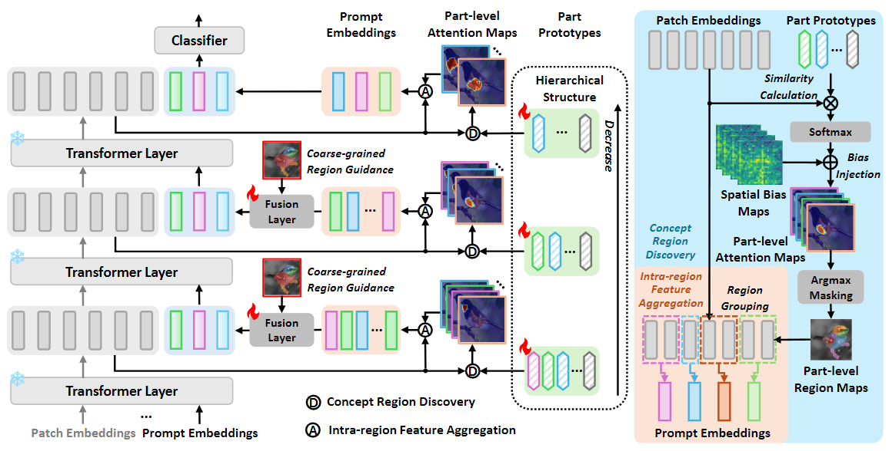
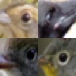
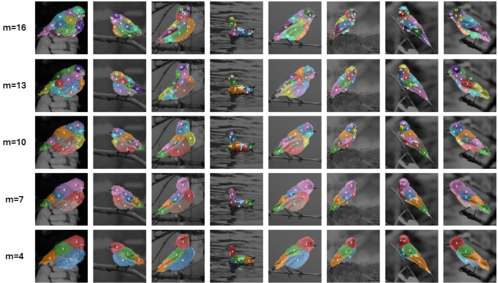

# IVPT：基于部件原型的可解释视觉提示微调（ICLR 2026）

> **[Exploring Interpretability for Visual Prompt Tuning with Cross-layer Concepts](https://openreview.net/pdf?id=NHP2Y8IVMU)**（《利用跨层概念探索视觉提示微调的可解释性》）
>
> [Yubin Wang](https://scholar.google.com/citations?user=mLeYNLoAAAAJ), [Xinyang Jiang](https://scholar.google.com/citations?user=JiTfWVMAAAAJ), [De Cheng](https://scholar.google.com/citations?user=180lASkAAAAJ),  Xiangqian Zhao,  [Zilong Wang](https://scholar.google.com/citations?user=gOaxHvMAAAAJ), [Dongsheng Li](https://scholar.google.com/citations?user=VNg5rA8AAAAJ), [Cairong Zhao](https://scholar.google.com/citations?user=z-XzWZcAAAAJ)


## ✨ 亮点



> **<p align="justify"> 摘要：** *视觉提示微调（visual prompt tuning）在将预训练视觉基础模型适配到特定任务方面具有显著优势。然而，现有研究对该方法的可解释性鲜有深入探讨，而可解释性对于提升 AI 的可靠性、实现由 AI 驱动的知识发现至关重要。在本文中，我们不再学习抽象的提示嵌入（prompt embeddings），而是在部件原型（part-prototype）解释框架下提出一组可解释的提示。每个提示都与一个具体的、人类可理解的语义概念相关联，该概念直接对应图像中的某个特定部件，从而使模型的行为更加透明、更易于解释。具体而言，我们提出了可解释视觉提示微调（Interpretable Visual Prompt Tuning，IVPT）——首个利用部件原型探索视觉提示微调可解释性的框架。我们引入了一种新颖的部件原型层次结构，用以解释网络各层中学到的提示。这些与类别无关（category-agnostic）的原型被用于发现概念区域，进而从这些区域聚合特征，得到用于微调的可解释提示。我们遵循部件原型解释框架，在细粒度分类基准上进行了全面的定性与定量评估，结果表明本方法在可解释性与准确率上均更为优越。* </p>

## :rocket: 贡献

- 我们提出了一个新颖的可解释视觉提示微调框架，以部件原型为桥梁，将可学习的提示与人类可理解的视觉概念连接起来。
- 我们引入了部件原型的层次结构，在解释网络多个层级提示的同时，以"由细到粗"的对齐方式建模它们之间的关系。
- 我们通过在细粒度分类基准上的大量定性与定量评估验证了方法的有效性。结果表明，与传统视觉提示微调方法以及以往基于部件原型的方法相比，本方法在可解释性与准确率上都有所提升。

## 📁 项目结构

```
IVPT/
├── train_net.py                    # 训练与评估主入口
├── argument_parser_train.py        # 命令行参数解析器
├── configs/                        # YAML 配置文件
│   └── cub_default.yaml            #   CUB-200-2011 的默认配置
├── models/                         # 模型结构
│   ├── layers/                     #   自定义 Transformer 层
│   │   ├── transformer_layers.py   #     带 QKV 返回的 Attention / Block
│   │   └── independent_mlp.py      #     各部件独立的 MLP 分类器
│   ├── individual_landmark_vit.py  #   IVPT 核心 ViT 模型
│   └── builder.py                  #   模型构建工具
├── data_sets/                      # 数据集与数据加载
│   ├── fg_bird_dataset.py          #   CUB / NABirds 数据集
│   └── builder.py                  #   数据集构建工具
├── engine/                         # 训练、评估与损失
│   ├── distributed_trainer_ivpt.py #   分布式训练器（DDP）
│   ├── eval_interpretability_nmi_ari_keypoint.py  # NMI/ARI/KPR 评估
│   ├── eval_fg_bg.py               #   前景/背景 IoU 评估
│   └── losses/                     #   损失函数
│       ├── builder.py              #     损失构建
│       ├── consistency_loss.py     #     跨层一致性
│       ├── equivarance_loss.py     #     等变性损失
│       ├── orthogonality_loss.py   #     原型正交性
│       ├── presence_loss.py        #     存在性损失（多种变体）
│       ├── enforced_presence_loss.py  # 强制存在性
│       ├── pixel_wise_entropy_loss.py # 逐像素熵
│       └── total_variation.py      #     全变差
├── eval/                           # 可解释性评估脚本
│   ├── evaluate_consistency.py     #   一致性与稳定性评估
│   ├── evaluate_parts.py           #   部件可解释性评估
│   └── ...                         #   其他辅助评估工具
├── utils/                          # 工具函数
│   ├── data_utils/                 #   数据变换、仿射变换、采样器
│   ├── training_utils/             #   优化器、调度器、DDP、checkpoint
│   ├── visualize_att_maps.py       #   注意力图叠加与层次可视化
│   ├── misc_utils.py               #   注意力计算、rollout 等
│   ├── get_landmark_coordinates.py #   关键点（landmark）坐标提取
│   ├── wandb_params.py             #   W&B 日志工具
│   ├── crop.py                     #   CUB 边界框裁剪
│   └── img_aug.py                  #   基于 Augmentor 的数据增强
├── scripts/                        # Shell 脚本
│   ├── run_train.sh                #   多 GPU 训练启动脚本
│   ├── run_test.sh                 #   分类评估
│   └── run_eval.sh                 #   可解释性评估
├── docs/                           # 文档与图片
│   └── INSTRUCTION.md              #   详细训练说明
├── requirements.txt                # Python 依赖
└── environment.yml                 # Conda 环境
```

## 🛠️ 安装

### 方式一：Conda（推荐）

```bash
conda env create -f environment.yml
conda activate ivpt
pip install -r requirements.txt
```

### 方式二：pip

```bash
pip install -r requirements.txt
```

## 🗂️ 数据准备

1. 从[这里](https://www.vision.caltech.edu/datasets/cub_200_2011/)下载 CUB-200-2011 数据集。
2. 将 `CUB_200_2011.tgz` 解压到 `datasets/` 目录：

```
datasets/
└── CUB_200_2011/
    ├── images/
    ├── image_class_labels.txt
    ├── train_test_split.txt
    └── ...
```

3. **（可选）** 运行数据预处理，进行裁剪与增强：

```bash
python utils/crop.py
python utils/img_aug.py --data_path datasets/cub200_cropped
```

## 🧪 训练

### 快速开始

```bash
# 多 GPU 训练（4 块 GPU）
bash scripts/run_train.sh

# 或直接运行
torchrun --nproc_per_node=4 train_net.py \
    --model_arch vit_base_patch14_reg4_dinov2.lvd142m \
    --pretrained_start_weights \
    --data_path datasets/CUB_200_2011 \
    --dataset cub \
    --batch_size 4 --epochs 25 \
    --freeze_backbone --gumbel_softmax \
    --n_pro 17,14,11,8,5
```

### 主要参数

| 参数 | 默认值 | 说明 |
|-----------|---------|-------------|
| `--n_pro` | `17,14,11,8,5` | ViT 各层的原型数量（逗号分隔） |
| `--model_arch` | `vit_base_patch14_reg4_dinov2.lvd142m` | 骨干网络结构（timm 模型名） |
| `--modulation_type` | `layer_norm` | 原型调制（modulation）类型：`layer_norm`、`original`、`parallel_mlp`、`none` |
| `--freeze_backbone` | `False` | 冻结骨干网络参数（推荐） |
| `--gumbel_softmax` | `False` | 对注意力图使用 Gumbel-Softmax |
| `--image_size` | `518` | 输入图像分辨率 |

所有训练参数也在 YAML 配置文件 `configs/cub_default.yaml` 中有记录，可供参考。

完整示例见 `scripts/run_train.sh`；更详细的训练说明（batch size 缩放、单 GPU 配置等）请参阅 `docs/INSTRUCTION.md`。

## 📊 评估

### 分类评估

```bash
# 使用便捷脚本
bash scripts/run_test.sh

# 或直接运行（加上 --eval_only 标志）
torchrun --nproc_per_node=4 train_net.py \
    --eval_only \
    --snapshot_dir ./snapshot \
    ... (与训练相同的参数)
```

### 可解释性评估

使用关键点回归（KPR）、NMI、ARI 或前景/背景 IoU 评估模型的可解释性：

```bash
# 使用便捷脚本
bash scripts/run_eval.sh

# 或直接运行
python eval/evaluate_consistency.py \
    --model_path ./snapshot/snapshot_best.pt \
    --dataset cub \
    --eval_mode nmi_ari \
    --num_parts 4 \
    --model_arch vit_base_patch14_reg4_dinov2.lvd142m \
    --data_path datasets/cub200_cropped \
    --n_pro 17,14,11,8,5
```

`--eval_mode` 支持的取值：`nmi_ari` | `kpr` | `fg_bg_iou`

## :art: 可视化

### 注意力图可视化

注意力图叠加结果会在评估运行期间**自动保存**。可视化展示了叠加在输入图像上的逐原型区域分割，以及每个原型对应的裁剪图块（patch）。

### 层次原型可视化

要生成展示跨层原型关系的层次原型可视化，请加上 `--enable_hierarchy_vis` 标志：

```bash
torchrun --nproc_per_node=4 train_net.py \
    --eval_only \
    --enable_hierarchy_vis \
    --snapshot_dir ./snapshot \
    ... (与训练相同的参数)
```

这会在 snapshot 目录中生成两类输出：

- **`results_hie_*/`**：按跨层关系组织原型的层次化文件夹布局。每个子文件夹包含一些图像裁剪块，用以展示某一层中某个特定原型所关联的视觉概念。

<p align="center">
  
  
  
</p>

- **`results_vis_*/`**：多层对比视图，展示部件区域分割在网络不同层之间的演变。

<p align="center">
  
</p>

## 🔍 引用

如果您使用了我们的工作，请考虑引用：

```bibtex
@misc{wang2026exploringinterpretabilityvisualprompt,
      title={Exploring Interpretability for Visual Prompt Tuning with Cross-layer Concepts}, 
      author={Yubin Wang and Xinyang Jiang and De Cheng and Xiangqian Zhao and Zilong Wang and Dongsheng Li and Cairong Zhao},
      year={2026},
      eprint={2503.06084},
      archivePrefix={arXiv},
      primaryClass={cs.CV},
      url={https://arxiv.org/abs/2503.06084}, 
}
```

## 📧 联系方式

如有任何问题，请在本仓库提交 issue，或通过 wangyubin2018@tongji.edu.cn 与我们联系。

## 😃 致谢

我们的代码基于 [PDiscoFormer](https://github.com/ananthu-aniraj/pdiscoformer) 仓库实现。感谢作者公开其代码。如果您使用了我们的模型与代码，也请考虑引用这些工作。
